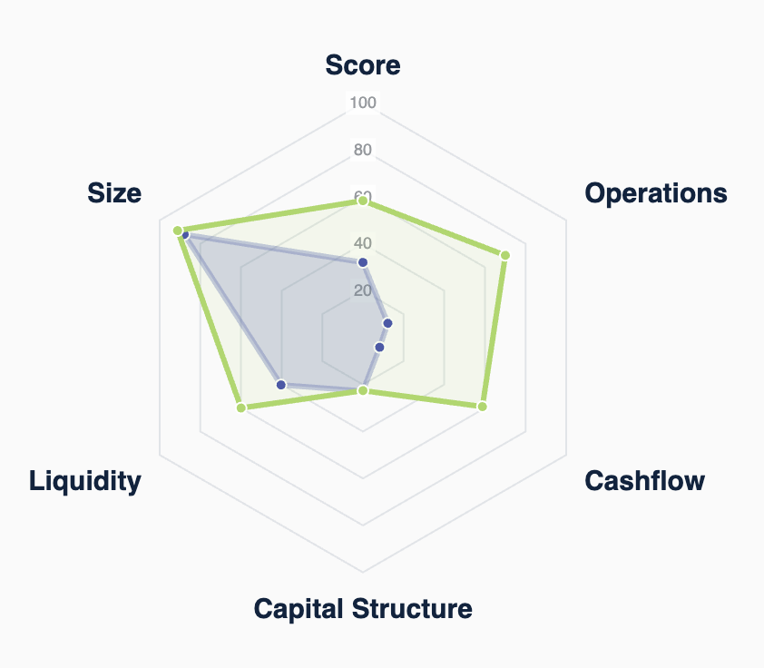

# \<inrisc-radar>



This webcomponent follows the [open-wc](https://github.com/open-wc/open-wc) recommendation.

## Installation

```bash
npm install -S git+https://github.com/assetblox/INRISC-radarchart
# or possibly:
npm install -S git+https://github.com/assetblox/INRISC-radarchart#semver:^0.1.0 
```

## Usage

```html
<script type="module">
  import 'inrisc-radar/inrisc-radar.js';
  const spiderData = data.spiderData;
</script>

<inrisc-radar .spiderData=${spiderData}></inrisc-radar>
```

Get the spiderData from the api.inrisc.com report. For example:
  https://staging.my.inrisc.com/public/rep_2VfDmrXlkf:8YCg9RaqkiQP4D5tARZUcFgs7ZHj44-HIwZT_ajlxHI

and pass it into the web component as a property.

## Linting and formatting

To scan the project for linting and formatting errors, run

```bash
npm run lint
```

To automatically fix linting and formatting errors, run

```bash
npm run format
```


## Tooling configs

For most of the tools, the configuration is in the `package.json` to reduce the amount of files in your project.

If you customize the configuration a lot, you can consider moving them to individual files.

## Local Demo with `web-dev-server`

```bash
npm start
```

To run a local development server that serves the basic demo located in `demo/index.html`
